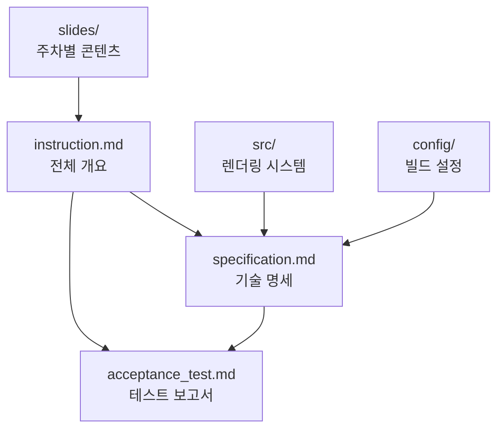

# Universal Presentation Management System - User Instructions

> **버전**: 2.0.0
> **최종 업데이트**: 2025년 10월 2일
> **시스템 유형**: 범용 프레젠테이션 관리 시스템

## 📖 문서 개요

이 프로젝트는 reveal.js 기반의 범용 프레젠테이션 관리 시스템입니다. 다양한 분야의 교육, 세미나, 워크샵, 컨퍼런스 콘텐츠를 체계적으로 관리하고 고품질 PDF로 생성할 수 있습니다. 각 프로젝트는 독립적으로 관리되며, 자동화된 네비게이션과 메타데이터 시스템을 통해 효율적인 콘텐츠 관리를 지원합니다.

## 🎯 시스템 특징

### 핵심 기능
- **📝 마크다운 기반**: 간편한 텍스트 편집으로 프레젠테이션 작성
- **🎨 테마 시스템**: 한글 폰트 지원 및 PDF 최적화
- **📄 PDF 생성**: 고품질 PDF 파일 자동 생성
- **🔄 자동화**: 콘텐츠 추가 시 자동 감지 및 네비게이션 생성
- **🌐 크로스 플랫폼**: Windows, Linux, macOS 지원

### 지원 프로젝트 유형
- **Course (강의)**: 대학 강의, 온라인 코스, 교육 프로그램
- **Seminar (세미나)**: 기술 세미나, 연구 발표, 학술 세미나
- **Workshop (워크샵)**: 실습 중심 교육, 핸즈온 세션
- **Conference (컨퍼런스)**: 학회 발표, 기업 컨퍼런스, 심포지엄
- **Custom (사용자 정의)**: 포트폴리오, 제품 소개, 프로젝트 발표

## 📂 프로젝트 구조

```
presentation-system/
├── src/                    # 렌더링 컴포넌트
│   ├── index.html         # 메인 엔트리 포인트 (다중 프로젝트 대시보드)
│   ├── css/               # 스타일시트
│   ├── js/                # JavaScript 모듈
│   ├── themes/            # 도메인별 테마
│   │   ├── academic.css   # 학술/교육용
│   │   ├── corporate.css  # 기업/비즈니스용
│   │   ├── conference.css # 컨퍼런스용
│   │   └── workshop.css   # 워크샵용
│   └── slides/            # 레거시 슬라이드 (호환성)
├── config/                 # 설정 파일
│   ├── vite.config.ts     # Vite 빌드 설정
│   └── server.js          # Express 서버
├── scripts/                # 실행 스크립트
│   ├── start-dev.sh/.bat  # 개발 서버 시작
│   ├── stop-dev.sh/.bat   # 개발 서버 종료
│   └── export-pdf.mjs     # PDF 생성
├── tools/                  # 관리 도구
│   └── bootstrap.py       # 프로젝트 스캔 및 네비게이션 생성
├── slides/                 # 콘텐츠 저장소 (다중 프로젝트)
│   ├── course-hmi/        # HMI 강의 (참조 구현)
│   ├── seminar-ai/        # AI 세미나
│   ├── workshop-web/      # 웹 워크샵
│   ├── conference-2024/   # 2024 컨퍼런스
│   └── [project-type-name]/ # 신규 프로젝트
│       ├── project.json   # 프로젝트 메타데이터
│       ├── session01/     # 세션별 콘텐츠
│       │   ├── slides.md  # 슬라이드
│       │   ├── summary.md # 세션 요약
│       │   └── resources/ # 리소스
│       └── ...
└── .claude/               # 프로젝트 문서
    ├── instruction.md           # 시스템 전체 가이드
    ├── specification.md         # 시스템 기술 명세
    ├── acceptance_test.md       # 시스템 테스트
    ├── instruction.contents.md  # 콘텐츠 제작 가이드 (HMI 예시)
    ├── specification.contents.md # 콘텐츠 기술 명세 (HMI 예시)
    └── acceptance.contents.md   # 콘텐츠 테스트 (HMI 예시)
```

## 👥 역할별 가이드

### 🔧 시스템 관리자 / 개발자
**대상**: 시스템 설치, 배포, 운영을 담당하는 사용자

**주요 문서**:
- **[instruction.md](instruction.md)** - 범용 시스템 설치 및 운영 가이드
- **[specification.md](specification.md)** - 기술 아키텍처 및 구현 명세
- **[acceptance_test.md](acceptance_test.md)** - 시스템 기능 테스트

**주요 작업**:
- 개발 환경 설정
- 서버 배포 및 관리
- 성능 모니터링
- 보안 관리
- 장애 대응

### 📝 콘텐츠 제작자 / 강사
**대상**: 슬라이드 콘텐츠를 작성하고 관리하는 사용자

**주요 문서**:
- **[instruction.contents.md](instruction.contents.md)** - 콘텐츠 작성 및 관리 가이드
- **[specification.contents.md](specification.contents.md)** - 콘텐츠 구조 및 품질 기준
- **[acceptance.contents.md](acceptance.contents.md)** - 콘텐츠 품질 테스트

**주요 작업**:
- 슬라이드 콘텐츠 작성
- 메타데이터 관리
- 품질 검토
- PDF 생성 및 배포

## 🚀 빠른 시작

### 1. 시스템 관리자 워크플로우

```bash
# 1. 의존성 설치
npm install

# 2. 개발 서버 시작
npm run dev                  # 직접 실행
# 또는
./scripts/start-dev.sh       # Linux/Mac
scripts\start-dev.bat        # Windows

# 3. 시스템 상태 확인
curl http://localhost:5173
```

**주요 관리 작업**: PDF 생성, 서버 배포, 콘텐츠 검증

### 2. 콘텐츠 제작자 워크플로우

```bash
# 1. 새 프로젝트 생성
mkdir slides/workshop-react
touch slides/workshop-react/project.json

# 2. 새 세션 생성
mkdir slides/workshop-react/session01-introduction
touch slides/workshop-react/session01-introduction/slides.md
touch slides/workshop-react/session01-introduction/summary.md

# 3. 프로젝트 스캔 및 네비게이션 업데이트
python3 tools/bootstrap.py

# 4. 개발 서버에서 미리보기
npm run dev
# 브라우저에서 http://localhost:5173?project=workshop-react&session=session01 접근

# 5. PDF 생성
npm run export-pdf -- --project workshop-react --session session01
```

**주요 작업**: 슬라이드 작성, 코드 예제 준비, 품질 검토

## 📊 시스템 상태

### 현재 버전 정보
- **시스템 버전**: 2.0.0 (범용 프레젠테이션 관리)
- **Reveal.js**: 5.0.4
- **Vite**: 5.1.4
- **Node.js**: 18+ 필요
- **Express**: 4.18.2 (프로덕션 서버)
- **Python**: 3.8+ (관리 도구)

### 지원 플랫폼
- **Windows**: 10, 11
- **macOS**: 12+
- **Linux**: Ubuntu 20.04+, CentOS 8+

### 브라우저 지원
- **Chrome**: 90+
- **Firefox**: 88+
- **Safari**: 14+
- **Edge**: 90+

## 🔗 문서 참조 관계



## 📝 문서 업데이트 정책

### 버전 관리
- **Major 버전**: 시스템 아키텍처 변경
- **Minor 버전**: 새로운 기능 추가
- **Patch 버전**: 버그 수정 및 개선

### 문서 동기화
- 시스템 변경 시 관련 문서 동시 업데이트
- 콘텐츠 표준 변경 시 가이드라인 반영
- 테스트 결과에 따른 문서 개선

## 🆘 지원 및 문의

### 주요 참조 문서
- **시스템 아키텍처**: [specification.md](specification.md) 참조
- **테스트 결과**: [acceptance_test.md](acceptance_test.md) 참조
- **주차별 콘텐츠**: `slides/weekXX/summary.md` 파일들
- **설정 파일**: `config/vite.config.ts`, `package.json`

---

📧 **지원**: 이 시스템에 대한 질문이나 제안사항이 있으시면 프로젝트 이슈 트래커를 이용해 주세요.

🔄 **업데이트**: 이 문서는 시스템 업데이트와 함께 지속적으로 개선됩니다.