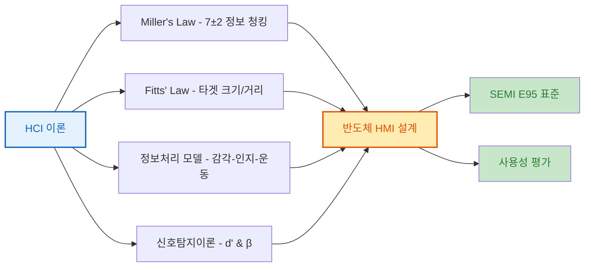

# Week 1: HCI/HMI 이론 및 반도체 장비 적용

## 학습 목표

1. **인간-컴퓨터 상호작용 기초**: HCI 핵심 법칙(Miller's Law, Fitts' Law)을 이해하고 반도체 HMI 설계에 적용하는 방법을 학습합니다.
2. **정보처리 모델**: 인간의 감각-인지-운동 시스템을 이해하고 실시간 공정 모니터링 UI 설계 원칙을 습득합니다.
3. **반도체 HMI 특수성**: 클린룸 환경, 고신뢰성 요구사항, SEMI 표준을 기반으로 한 HMI 설계 방법론을 학습합니다.

---

## 이번 주 주요 내용

### 배경
반도체 제조 장비(CVD, PVD, ETCH, CMP)는 24/7 연속 운전되며, 운영자의 실수는 수백억원의 손실로 이어질 수 있습니다. HCI 이론을 적용한 과학적 HMI 설계가 필수적입니다.

### 핵심 개념
- **Miller's Law (7±2)**: 인간의 단기 기억 용량을 고려한 정보 청킹 및 계층화 전략
- **Fitts' Law**: 목표물 크기와 거리를 고려한 버튼 배치 및 터치 영역 설계
- **정보처리 모델**: 감각(250ms) → 인지(100ms-2s) → 운동(70-100ms) 단계별 최적화
- **신호탐지이론 (SDT)**: 알람 민감도(d')와 반응 편향(β)을 통한 False Alarm 최소화

### 실습 내용
- ASML, Applied Materials, Tokyo Electron 실제 HMI 사례 분석
- SEMI E95 표준 기반 에르고노믹 가이드라인 평가
- HMI 사용성 테스트 방법론 (SUS, NASA-TLX, SAGAT) 실습

---

## Week 1 HCI 이론 핵심

- **Miller's Law**: 반도체 HMI는 한 화면에 7±2개 이하의 핵심 파라미터만 표시 (온도, 압력, 가스유량 등)
- **Fitts' Law**: 긴급 정지 버튼은 크기 50mm 이상, 중앙에서 300mm 이내 배치
- **정보처리 모델**: 알람 발생 → 인지(250ms) → 판단(500ms) → 조치(100ms) = 총 850ms 이내 처리

---

## HCI 이론과 반도체 HMI 설계

---

## 반도체 HMI 특수 요구사항

| 요구사항 분류 | 항목 | 기준값 | 비고 |
|------------|------|--------|------|
| **클린룸 환경 (ISO 14644-1)** | Class 1 입자 농도 | <10개/m³ (0.1μm) | 최첨단 리소그래피 |
| | 온도 제어 정밀도 | ±0.1°C | 일부 공정 ±0.05°C |
| | 습도 제어 정밀도 | ±1% RH | 포토 공정 45±1% 유지 |
| **고신뢰성** | MTBF (평균 고장 간격) | >8760시간 | 1년 이상 |
| | MTTR (평균 수리 시간) | <30분 | 신속 복구 |
| | 가용성 | 99.94% | MTBF/(MTBF+MTTR) |
| **실시간 응답** | 일반 HCI 응답 시간 | 100ms-2s | 일반 시스템 |
| | 반도체 HMI 응답 시간 | 10ms-100ms | 10배 빠른 응답 |
| | 알람 응답 시간 | <50ms | 운영자 인지 250ms 이내 |
