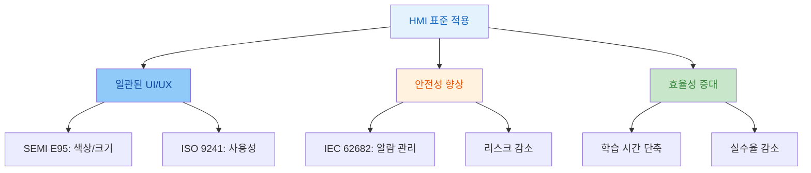
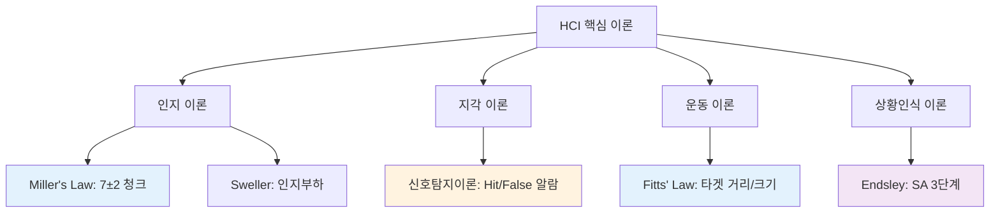
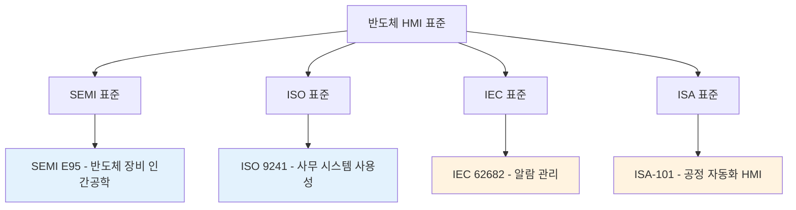
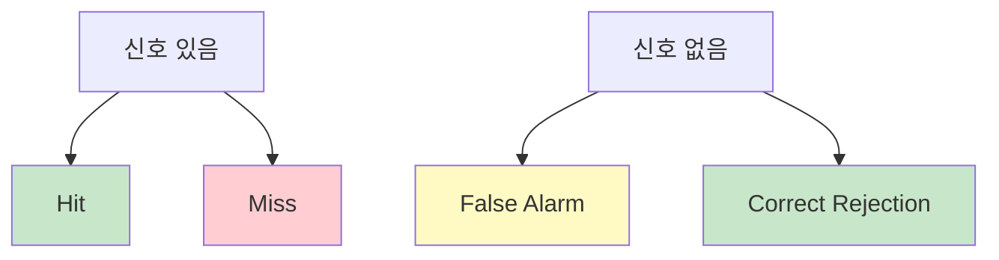

## HCI/HMI 표준의 필요성 (1/2)

### 배경: 왜 표준이 필요한가?

**반도체 산업의 문제 상황**:
- FAB 내 다양한 제조사 장비(ASML, TEL, AMAT 등)가 각각 다른 HMI 인터페이스 사용
- 운영자는 장비마다 다른 버튼 위치, 색상 코드, 알람 시스템을 학습
- 운영 실수와 생산성 저하로 이어짐

**해결책**:
HCI/HMI 국제 표준을 통해 일관된 인터페이스 제공:
- 학습 곡선 단축 (신규 운영자 교육 시간 4-8주 → 2-3주)
- 실수 감소 (표준화된 색상, 버튼, 알람)
- 글로벌 운영 효율성 증가 (다국적 FAB 운영)

---

## HCI/HMI 표준의 필요성 (2/2)

### 핵심 개념: HCI 표준의 역할

**HCI 표준이란**:
- 인간-컴퓨터 상호작용 설계를 위한 국제적으로 합의된 가이드라인과 규격 
- 사용자 인터페이스의 일관성, 안전성, 효율성 보장

**주요 표준 체계**:
- **SEMI E95**: 반도체 장비 전용 인간공학 가이드라인
- **ISO 9241**: 사무용 시스템 사용성 표준
- **IEC 62682**: 산업 제어 시스템 알람 관리
- **ISA-101**: 공정 자동화 HMI 표준

**동작 메커니즘**:
- 표준은 색상(빨강=위험), 크기(최소 터치 영역 11mm), 배치(중요 정보 중앙 ±15°) 등을 정의
- 사용자가 직관적으로 시스템을 이해하고 조작할 수 있게 함

---

## HCI/HMI 표준 적용 사례

### 실제 사례: CVD 장비 HMI 표준화

**CVD 장비 적용 예시**:
SEMI E95 표준 적용 전후 비교
- **적용 전**: 운영자 실수율 5.2%, 장비 전환 교육 6주 소요
- **적용 후**: 운영자 실수율 1.8%, 장비 전환 교육 2주로 단축
- **데이터 범위**: 온도 400-600°C, 압력 1-100 Torr, 가스 유량 10-200 sccm

**HCI 이론 적용 - Miller's Law**:
- 표준은 정보를 7±2 청크로 그룹화하여 작업기억 부담 경감
- 예: 운영자가 한눈에 상태를 파악할 수 있도록 CVD 파라미터를 "온도", "압력", "가스"의 3개 그룹으로 분류

---

**정보처리 모델 적용**:
- 인간은 입력→지각→인지→응답의 단계를 거침
- 표준화된 인터페이스는 지각 단계를 단축시켜 250ms 이내 응답을 가능함

---

## HCI 핵심 이론 정리

### 배경: HCI 이론이 반도체 HMI에 필요한 이유

**반도체 장비 운영의 복잡성**:
- 운영자는 수십 개의 파라미터를 동시에 모니터링하고, 밀리초 단위로 알람에 대응해야 함
- 인간의 인지적 한계를 고려하지 않은 HMI는 실수와 사고를 유발함

**HCI 이론의 해결책**:
- 인간의 지각, 인지, 운동 능력을 과학적으로 분석한 이론을 적용하여 인간 중심의 HMI 설계

---

## HCI 이론 적용 (1/2) - Miller's Law

### 핵심 개념: Miller's Law (작업기억 한계)

**Miller, G.A. (1956)**. "The magical number seven, plus or minus two"
- *Psychological Review*, 63(2), 81-97

- **정의**: 인간은 단기 기억에 평균 7±2개의 정보 청크를 유지할 수 있음
- **목적**: 인지 부하를 줄여 정보 처리 효율을 높이고 운영자 실수 방지
- **적용 범위**: HMI 파라미터 그룹화, 알람 카테고리 분류, 메뉴 구조 설계

### CVD 장비 HMI 적용 예

| 적용 영역 | 설계 원칙 | 구체적 예시 |
|----------|----------|------------|
| **파라미터 그룹화** | 5-9개 청크로 구성 | 온도(3), 압력(2), 가스(3) = 총 8개 청크 |
| **알람 카테고리** | 3개 그룹으로 분류 | Critical, Warning, Info |
| **메뉴 깊이** | 최대 6단계 이하 | 탐색 부담 감소 |

---

## HCI 이론 적용 (2/2) - Fitts' Law

### 핵심 개념: Fitts' Law (타겟 선택 시간)

**Fitts, P.M. (1954)**. "The information capacity of the human motor system"
- *Journal of Experimental Psychology*, 47(6), 381-391

**핵심 공식**:
$$
MT = a + b \log_2\left(\frac{D}{W} + 1\right)
$$
- MT: 이동 시간, D: 거리, W: 타겟 크기, a,b: 상수

---

**반도체 HMI 적용**:
- **긴급정지 버튼**: 80×80 pixel 이상으로 크게 설계하여 빠른 접근 보장
- **자주 사용하는 버튼**: 화면 중앙 근처 배치로 이동 거리 최소화
- **작은 버튼 회피**: 20 pixel 이하 버튼은 오조작 위험으로 금지

---

## HCI 심화 이론 (상황인식) 

### Situation Awareness (상황인식 이론)

**Endsley, M.R. (1995)**. "Toward a theory of situation awareness"
- *Human Factors*, 37(1), 32-64

**SA 3단계 모델**:

**HMI 적용 사례**:
- **Level 1 (지각)**: CVD 온도계 250°C 표시
- **Level 2 (이해)**: "온도가 설정값보다 높음" 판단
- **Level 3 (예측)**: "10분 후 과열 알람 발생 예상" 예측

---

## HCI 심화 이론

### Cognitive Load (인지부하 이론)

#### **Sweller, J. (1988)**. "Cognitive load during problem solving"
- *Cognitive Science*, 12(2), 257-285

**인지부하 3가지 유형**:
- **Intrinsic (본질적)**: 과업 고유의 복잡도
- **Extraneous (외재적)**: 불필요한 설계로 인한 부하
- **Germane (생산적)**: 학습/이해 촉진 부하

### **HMI 설계 전략**:
- 외재적 부하 최소화 - 불필요한 애니메이션 제거 (깜빡임↔정적 표시)
- 본질적 부하 관리 - 파라미터 그룹화로 청킹 적용

---

## HMI 추천 도서

### 1. **Sheridan, T.B. (2002)**. "Humans and automation"
- John Wiley & Sons
- 자동화와 인간의 역할 분배, 감독 제어

### 2. **Vicente, K.J. (1999)**. "Cognitive work analysis"
- Lawrence Erlbaum
- 인지 작업 분석 프레임워크, 생태학적 인터페이스 설계

### 3. **Rasmussen, J. (1983)**. "Skills, rules, and knowledge"
- *IEEE Trans. SMC*, 13(3), 257-266
- SRK 모델: 기술 기반, 규칙 기반, 지식 기반 행동

---

## 국제 표준 체계

---

## 상세 표준 (1/3) - SEMI E95

### Specification for Human Interface for Semiconductor Manufacturing Equipment
**SEMI E95-0301 (2020) - 반도체 제조 장비 인간공학 가이드라인**

| 요구사항 항목 | 기준값 | 비고 |
|-------------|--------|------|
| 화면 크기 | 최소 21인치 | 1920×1080 권장 |
| 폰트 크기 | 최소 12pt | 중요 정보 14pt |
| 색상 대비 | 최소 4.5:1 | WCAG 2.1 AA 준수 |
| 정보 계층 | 최대 3단계 | 인지 부하 감소 |

---

## 상세 표준 (2/3) - ISO 9241

### Ergonomics of human-system interaction
**ISO 9241-210:2019 - 인간 중심 설계 프로세스 표준**

**6단계 프로세스**:
1. 사용 맥락 이해
2. 사용자 요구사항 명세
3. 설계 솔루션 개발
4. 프로토타입 평가
5. 설계 개선 반복
6. 최종 검증

---

## 상세 표준 (3/3) - IEC & ISA

### IEC 62682:2014 - 산업 제어 시스템 알람 관리 표준

| 알람 관리 항목 | 기준값 | 비고 |
|--------------|--------|------|
| 알람 비율 | 시간당 최대 6개 | 운영자당 |
| Critical 알람 비율 | 1% | 즉시 대응 |
| Warning 알람 비율 | 15% | 주의 필요 |
| Info 알람 비율 | 84% | 정보 전달 |
| Critical 대응 시간 | 10분 이내 | 긴급 조치 |
| Warning 대응 시간 | 1시간 이내 | 계획된 조치 |

### ANSI/ISA-101.01-2015 - 공정 자동화 HMI 설계 표준

**High Performance HMI 원칙**:
- 정보 계층 구조 (Overview → Detail 4단계)
- 색상 사용 최소화 (정상=회색, 비정상=색상)
- 화면당 정보 밀도 제한 (파라미터 8개 이하)

---

## 신호탐지이론 (SDT, Signal Detection Theory)

### 배경 및 핵심 개념
**반도체 HMI 문제**:
- Miss (놓침) → Critical 알람 무시로 웨이퍼 손상
- False Alarm (오경보) → 불필요한 공정 중단

**신호탐지이론 해결책**:
신호(알람)와 잡음(정상 변동)을 구분하는 운영자의 판단 능력을 정량화함

### SDT 4가지 결과

---

## 신호탐지이론 적용 (1/2)

### 개요
- 불확실한 상황에서 자극(신호)의 존재 여부를 판단하는 과정에 대한 이론
-  자극을 받아들이는 관찰자의 '민감도(감도)'와 관찰자의 '반응 기준(판정 기준)' 두 가지 요소가 탐지 결과에 영향을 미침
- 소음이 있는 환경에서 신호의 존재 유무를 판단하는 능력과 개인의 판단 성향을 분석하는 데 활용

### 개념
- 신호(Signal): 탐지하려는 자극이나 정보 패턴
- 잡음(Noise): 신호 탐지를 방해하는 무작위적인 패턴 또는 배경 자극
- 민감도(Sensitivity, d'): 신호와 잡음을 얼마나 잘 구별해내는지 나타내는 능력
- 반응 기준(Criterion): 관찰자가 신호가 있다고 판단할 때 얼마나 엄격하게 적용하는지를 나타내는 기준

---

## 신호탐지이론 적용 (2/2)

### 민감도 지수 및 HMI 설계

**민감도 지수 (d')**:
$$
d' = Z(Hit) - Z(FA)
$$

**HMI 설계 기준**:
- Critical 알람: d' > 2.0 (높은 민감도 필수)
- 청각 신호: 배경 대비 +15dB 이상
- 시각 신호: 색상 대비비 7:1 이상

---

### 참고문헌

#### 1. **Green & Swets (1966)**
- Signal detection theory and psychophysics, New York: Wiley.
- 신호탐지이론의 기초 확립

#### 2. **Macmillan & Creelman (2004)**
- Detection theory: A user's guide, Mahwah, NJ: Lawrence Erlbaum Associates.
- 실무 적용 방법론

---

## 추천 참고문헌
### 1. **Stanton et al. (2004)**
- *Handbook of human factors methods*, Boca Raton, FL: CRC Press.
- HCI 실험 방법론 총정리

### 2. **Wickens et al. (2013)**
- *Engineering psychology and human performance* (4th ed.), Upper Saddle River, NJ: Pearson.
- 인간 정보처리 모델, 주의, 의사결정

---

## 학술 데이터베이스 활용
### 주요 DB 및 검색어

| 분야 | 데이터베이스 | 검색어 예시 |
|------|------------|----------|
| 인지심리학 / 기억 | **PubMed** | "working memory" AND "display" |
| 반도체 HMI | **IEEE Xplore** | "semiconductor HMI" |
| UI/UX 설계 | **ACM DL** | "alarm management" |
| 상황인식 | **ScienceDirect** | "situation awareness" |

### 데이터베이스 특징

- **PubMed**: 생의학, 인지신리학 논문 검색
- **IEEE Xplore**: 공학, 제어 시스템 논문
- **ACM DL**: HCI, 컴퓨터 과학 논문
- **Google Scholar**: 다학제 통합 검색

---

## 실습 과제 안내
### 실습 주제
**1. Miller's Law 검증 실험**
- 반도체 HMI 파라미터 기억 실험
- 아이템 개수 3, 5, 7, 9, 11개 조건 비교
- 정확도 측정 및 그래프 작성

**2. Fitts' Law 측정 실험**
- 버튼 거리(D), 크기(W)에 따른 이동 시간 측정
- 회귀 분석: $MT = 50 + 150 \log_2(D/W + 1)$
- 긴급정지 버튼 최적 크기 제안: MT < 500ms

**3. SEMI E95 표준 적용 설계**
- 기존 HMI 분석 - Gap Analysis 수행
- 표준 준수 재설계 제안

**제출 형식**: 보고서 10-15페이지(실험 데이터), MT 측정값 300-800ms, 정확도 70-80%
