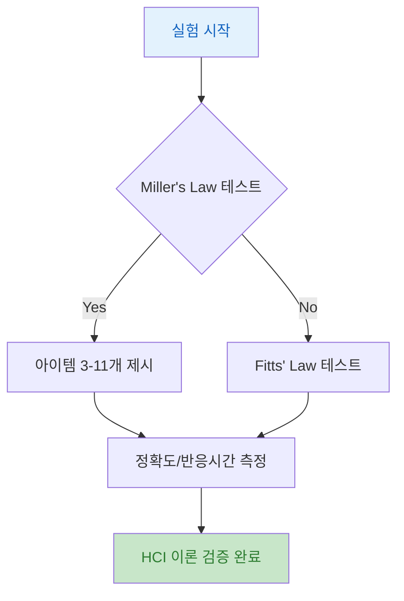

## 실습 1: Miller's Law & Fitts' Law 측정

### **반도체 산업의 문제**:
- FAB 운영자들이 복잡한 HMI를 사용할 때 실제로 얼마나 많은 정보를 기억하고, 버튼을 얼마나 빨리 누를 수 있는지 정량적 데이터가 부족함 

### **실습의 해결책**:
실험을 통해 Miller's Law와 Fitts' Law를 직접 검증하고, 실제 반도체 HMI 설계에 적용 가능한 데이터 수집
- 작업기억 용량 측정 (3, 5, 7, 9, 11개 아이템 테스트)
- 타겟 크기/거리별 이동 시간 측정 (D: 100-400px, W: 20-80px)
- Before/After HCI 이론 적용 효과 검증

---

### 핵심 개념: 인간 성능 측정 방법론

**실험 설계 원리**:
통제된 환경에서 독립변수(아이템 개수, 타겟 크기)를 변화시키고 종속변수(정확도, 반응시간)를 측정하여 인간의 인지/운동 능력을 정량화합니다.

**측정 지표**:
1. **Miller's Law 검증**: 아이템 개수별 정확도 (3개: 95-100%, 7개: 70-85%, 11개: 25-45%)
2. **Fitts' Law 검증**: 타겟 거리/크기에 따른 이동 시간 (MT = a + b × log₂(D/W + 1))
3. **HCI 적용 효과**: Before/After 비교를 통한 개선율 측정

---

### Week 1 HCI 이론 연결

**정보처리 모델 적용**:
- Miller's Law 실험은 인간의 작업기억(Working Memory) 단계를 직접 측정
- 정보처리 모델의 "지각 → 인지 → 응답" 과정에서 인지 단계의 용량 제한 확인

**실습을 통한 검증**:
이론적으로 7±2개의 청크를 기억할 수 있다는 Miller's Law를 실험으로 확인

---

## 실험 흐름



---

### 실습 목표 (1/2)

#### 1. **실험 1: 작업기억 용량 측정**
- Miller's Law 이론 검증
- 실험 설계: 피험자 20명 이상
- 데이터 분석: HCI 이론 적용 효과 비교 (Before/After 정확도)

#### 2. **실험 2: 타겟 선택 시간 측정**
- Fitts' Law 이론 검증
- 실험 설계: 조건 30회 이상 반복
- 데이터 분석: HCI 이론 적용 효과 비교 (Before/After 반응시간)

---

### 실습 목표 (2/2)

#### 3. **실험 3: 표준 준수 평가**
- SEMI E95 Gap Analysis 수행
- 측정 항목: UI 요소 크기, Miller's Law 청킹, Fitts' Law MT 예측
- 성공 기준: Miller's Law 정확도 >90%, Fitts' Law MT <500ms

#### **제출 요구사항**:
- [x] 실험 데이터 (원본 CSV 파일)
- [x] 통계 분석 결과 (그래프, 회귀식)
- [x] HMI 개선 제안서

---

## Miller's Law 실험 설계

### 실험 절차 및 조건:
- **피험자**: 대학생 또는 운영자 (N=20-30명)
- **독립 변수**:
  - 아이템 개수: 3, 5, 7, 9, 11개
  - 각 조건당 10회 반복 시행

---

## Miller's Law 실험 진행

### 1. 사전 준비: 피험자 모집, ID 부여, 실험 환경 준비 (조용한 공간)
2. 실험 실시: 조건 5개 × 시행 10회 = 총 50회  
3. 데이터 수집: 정확도(%), 반응시간(ms) 기록, Excel 정리

---

## Miller's Law 예상 결과

### 정확도 예측

| 아이템 개수 | 예상 정확도 | HMI 적용 가능성 |
|-----------|------------|---------------|
| 3개 | 95-100% | 핵심 파라미터만 |
| 5개 | 85-95% | 권장 (최적) |
| 7개 | 70-85% | 허용 가능 |
| 9개 | 45-65% | 위험 영역 |
| 11개 | 25-45% | 사용 금지 |

---

## Miller's Law HMI 설계 적용

### 파라미터 그룹화 전략

**목표**: 5-7개 청크로 제한하여 90% 이상 정확도 확보

**반도체 장비 예시 - CVD 시스템**:
- 온도 그룹 (3개): Chamber, Upper, Lower
- 압력 그룹 (2개): Process, Base
- 가스 그룹 (3개): SF6, O2, He

**총 8개 청크 → Miller's Law 준수 (7±2)**

---

## Fitts' Law 실험 설계

### 실험 조건

| 타겟 거리(D) | 타겟 크기(W) | 난이도 지수(ID) | 예상 MT |
|------------|------------|----------------|---------|
| 100px | 20px | 2.32 bits | 332ms |
| 100px | 40px | 1.58 bits | 258ms |
| 100px | 80px | 0.81 bits | 181ms |
| 200px | 20px | 3.32 bits | 432ms |
| 200px | 40px | 2.58 bits | 358ms |
| 200px | 80px | 1.81 bits | 281ms |
| 400px | 20px | 4.39 bits | 539ms |
| 400px | 40px | 3.32 bits | 432ms |
| 400px | 80px | 2.58 bits | 358ms |

**공식**: MT = 100 + 100 × ID (예상 계수)

### 실험 절차 및 조건:
**독립 변수 (9가지 조합)**:
- 타겟 거리(D): 100px, 200px, 400px
- 타겟 크기(W): 20px, 40px, 80px
- 총 9가지 조건 (3×3)

---

## Fitts' Law 실험 코드 (JavaScript) - Part 1

<div class="grid grid-cols-2 gap-8">
<div>

- **문제**: 반도체 HMI에서 버튼 크기와 배치를 결정할 때 과학적 근거 없이 디자이너의 직관에만 의존하면 운영자의 오조작이 발생

- **해결책**: Fitts' Law 실험 코드로 타겟 거리(D)와 크기(W)에 따른 이동 시간(MT)을 측정하여 최적의 버튼 크기/배치 결정

```javascript [1-25]
// Fitts' Law 실험 클래스
class FittsLawExperiment {
constructor() {
this.canvas = document.getElementById('experimentCanvas');
this.ctx = this.canvas.getContext('2d');
this.results = [];
this.currentTrial = 0;
this.conditions = this.generateConditions();
}
generateConditions() {
const distances = [100, 200, 400];
const widths = [20, 40, 80];
let conditions = [];
for(let d of distances) {
for(let w of widths) {
conditions.push({
distance: d,
width: w,
indexOfDifficulty: Math.log2(d/w + 1)
});
}
}
return this.shuffleArray(conditions);
```

</div>
<div>

### 코드 해설

**핵심 라인 설명**:
- **Line 4-7**: Canvas 초기화 및 실험 데이터 저장 배열 생성
- **Line 11-12**: 거리 3종(100, 200, 400px), 크기 3종(20, 40, 80px) 정의
- **Line 19**: **Fitts' Law 난이도 지수(ID)** 계산: ID = log₂(D/W + 1)
  - 예: D=400, W=20 → ID = log₂(21) ≈ 4.4 bits (높은 난이도)
- **Line 23**: 조건을 무작위 순서로 섞어 학습 효과 제거

</div>
</div>

---

## Fitts' Law 실험 코드 (JavaScript) - Part 2 (1/2)

<div class="grid grid-cols-2 gap-8">
<div>

<pre><code class="language-javascript" data-line-numbers data-ln-start-from="26">startTrial() {
const condition = this.conditions[this.currentTrial];
this.startTime = performance.now();
// 시작점과 타겟 그리기
this.drawStartPoint(50, 300);
this.drawTarget(50 + condition.distance, 300, condition.width);
this.canvas.addEventListener('click', this.handleClick.bind(this));
}

handleClick(event) {
const endTime = performance.now();
const rect = this.canvas.getBoundingClientRect();
const x = event.clientX - rect.left;
const y = event.clientY - rect.top;
const condition = this.conditions[this.currentTrial];
const targetX = 50 + condition.distance;
const targetY = 300;
const hit = this.isWithinTarget(x, y, targetX, targetY, condition.width);
const movementTime = endTime - this.startTime;
</code></pre>
</div>
<div>

**시험 시작 및 클릭 처리**
- **Line 26-35**: 시험 시작 메서드
- **Line 27**: 현재 시험 조건 가져오기
- **Line 28**: 시작 시간 기록 (밀리초 정밀도)
- **Line 31-32**: 시작점 (50, 300) 및 타겟 그리기
- **Line 34**: 클릭 이벤트 리스너 등록
- **Line 37-50**: 클릭 이벤트 처리
- **Line 38**: 종료 시간 기록
- **Line 39-41**: 마우스 좌표를 캔버스 좌표로 변환
- **Line 44-45**: 타겟 중심 좌표 계산
- **Line 47**: 타겟 내부 클릭 여부 판정
- **Line 48**: 이동 시간 계산 (종료 - 시작)

</div>
</div>

---

## Fitts' Law 실험 코드 (JavaScript) - Part 3

<div class="grid grid-cols-2 gap-8">
<div>

<pre><code class="language-javascript" data-line-numbers data-ln-start-from="51">this.results.push({
trial: this.currentTrial + 1,
distance: condition.distance,
width: condition.width,
indexOfDifficulty: condition.indexOfDifficulty,
movementTime: movementTime,
hit: hit,
actualX: x,
actualY: y
});
this.nextTrial();
}
calculateResults() {
const validTrials = this.results.filter(r => r.hit);
// 선형 회귀: MT = a + b * ID
const xValues = validTrials.map(r => r.indexOfDifficulty);
const yValues = validTrials.map(r => r.movementTime);
const n = xValues.length;
const sumX = xValues.reduce((a, b) => a + b, 0);
const sumY = yValues.reduce((a, b) => a + b, 0);
const sumXY = xValues.reduce((sum, x, i) => sum + x * yValues[i], 0);
const sumXX = xValues.reduce((sum, x) => sum + x * x, 0);
</code></pre>

</div>
<div>

**데이터 저장 및 회귀 분석**
- **Line 51-59**: 시험 결과 객체 저장
  - 시험 번호, 거리, 크기, ID, 이동 시간
  - 명중 여부, 실제 클릭 좌표

- **Line 61**: 다음 시험으로 진행

- **Line 64-75**: 결과 계산 및 회귀 분석
- **Line 65**: 성공한 시험만 필터링 (명중한 경우만)
- **Line 68-69**: X축(난이도 지수) Y축(이동 시간) 배열 생성
- **Line 71-75**: 선형 회귀 계산을 위한 합계 계산
  - n: 시험 횟수, sumX/Y: 합계, sumXY/XX: 곱의 합계

</div>
</div>

---

## Fitts' Law 실험 코드 (JavaScript) - Part 4

<div class="grid grid-cols-2 gap-8">
<div>

<pre><code class="language-javascript" data-line-numbers data-ln-start-from="76">const slope = (n * sumXY - sumX * sumY) / (n * sumXX - sumX * sumX);
const intercept = (sumY - slope * sumX) / n;
return {
a: intercept,
b: slope,
equation: `MT = ${intercept.toFixed(2)} + ${slope.toFixed(2)} * ID`,
rSquared: this.calculateRSquared(xValues, yValues, slope, intercept)
};
}
}
</code></pre>

</div>
<div>

**회귀 분석 및 결과 반환**
- **Line 76-77**: 최소제곱법으로 기울기와 절편 계산
- **slope**: Fitts' Law 계수 (b)
- **intercept**: y절편 (a), 기본 반응시간

- **Line 79-84**: 결과 객체 반환
- **a, b**: 회귀 계수 (MT = a + b × ID)
- **rSquared**: 결정계수 (모델 적합도, 0.9 이상 우수)

</div>
</div>

---

## Fitts' Law 예상 결과

### 예상 회귀식 및 적용
- **회귀 방정식**: MT = a + b × ID
- **예상 계수**: a = 100-200ms (기본 반응시간), b = 100-200ms/bit
- **긴급정지 버튼 설계**: W ≥ 80px, D ≤ 300px → MT < 500ms