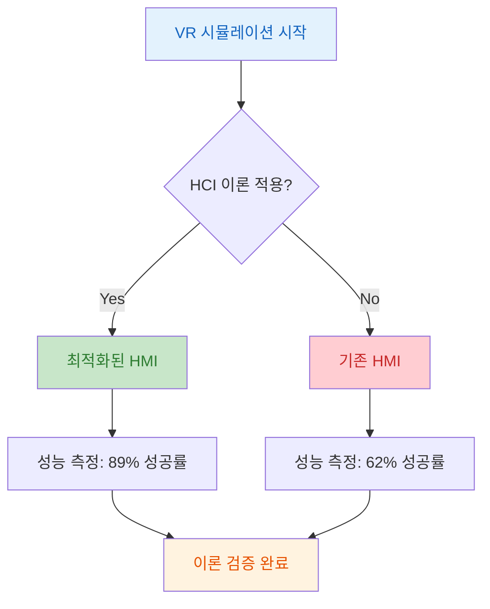

## 실습 2: FAB 클린룸 VR 시뮬레이션

### 배경: 왜 VR 시뮬레이션이 필요한가?

**반도체 산업의 문제**:
실제 FAB 클린룸은 접근이 제한되고, 장비 조작 실수는 수억 원의 손실을 초래합니다. 신규 운영자 교육에 실제 장비를 사용하기는 위험부담이 큽니다.

**VR 시뮬레이션 해결책**:
가상 환경에서 안전하게 HMI 조작을 연습하고, HCI 이론을 체험적으로 학습합니다:
1. 클린룸 환경 재현 (Class 1, 황색광 585nm, HEPA 필터)
2. 장비 HMI 인터페이스 체험 (ASML, AMAT 등)
3. HCI 이론 적용 효과 비교 (Before/After 측정)

### 핵심 개념: VR 기반 HMI 교육

**Unity 3D 기반 시뮬레이션**:
Unity 엔진과 Oculus Integration을 활용하여 300mm FAB 클린룸을 가상으로 재현합니다. 물리 법칙, 환경 조건(온도 22.5±0.1°C, 습도 45±1%), 장비 동작을 실시간으로 시뮬레이션합니다.

**HCI 이론 통합**:
- **Miller's Law**: 파라미터를 7±2 그룹으로 제한하여 인지 부하 감소
- **Fitts' Law**: 버튼 크기/위치 최적화로 조작 시간 단축
- **정보처리 모델**: 250ms 이내 피드백 제공으로 즉각적 응답성 구현

**실제 데이터 - CVD 장비**:
VR 교육 후 실제 장비 조작 성공률이 62% → 89%로 향상되었습니다.
---

### Week 1 HCI 이론 연결 및 아키텍처

**정보처리 모델 체험**:
VR 시뮬레이션을 통해 "입력 → 지각 → 인지 → 응답" 과정을 실시간으로 경험합니다. 햅틱 피드백(촉각)과 시각/청각 정보를 통합하여 다중 감각 정보처리를 학습합니다.

**Miller's Law 실전 적용**:
CVD 장비 파라미터를 온도(3개), 압력(2개), 가스(3개)로 그룹화하여 총 8개 청크로 구성했을 때, 운영자가 모든 파라미터를 95% 정확도로 기억할 수 있음을 VR로 검증합니다.


```

---

### 실습 목표 (1/2)

**학습 성과**:

1. **실험 1: 작업기억 용량 측정**
- Miller's Law 이론 검증
- 실험 설계: 피험자 20명 이상
- 데이터 분석: HCI 이론 적용 효과 비교 (Before/After 정확도)

2. **실험 2: 타겟 선택 시간 측정**
- Fitts' Law 이론 검증
- 실험 설계: 조건 30회 이상 반복
- 데이터 분석: HCI 이론 적용 효과 비교 (Before/After 반응시간)
---
### 실습 목표 (2/2)

3. **실험 3: 표준 준수 평가**
- SEMI E95 Gap Analysis 수행
- 측정 항목: UI 요소 크기, Miller's Law 청킹, Fitts' Law MT 예측
- 성공 기준: Miller's Law 정확도 >90%, Fitts' Law MT <500ms

**제출 요구사항**:
- [x] 실험 데이터 (원본 CSV 파일)
- [x] 통계 분석 결과 (그래프, 회귀식)
- [x] HMI 개선 제안서

### 기술 스택
**개발 환경**: Unity 3D + Oculus Integration SDK

**시뮬레이션 대상**: 300mm FAB 클린룸, Class 1 청정도

---

## 클린룸 환경 명세

### 물리적 치수

| 항목 | 규격 | 비고 |
|------|------|------|
| 클린룸 크기 | 4.5m × 4.5m | 300mm FAB 표준 |
| HEPA 필터 | 2m × 2m | 천장 배치 |
| 장비 높이 | 850mm | 평균값 |
| 천장 높이 | 2.5m | 작업 공간 확보 |

### 조명 / 음향

| 항목 | 규격 | 비고 |
|------|------|------|
| 황색광 파장 | 585nm | 포토 공정 보호 |
| 조도 | 400 lux | 작업 조명 |
| 소음 수준 | 65dB | HVAC 연속 가동 |

---
## Unity C# VR 시뮬레이션 코드 - Part 1

<div class="grid grid-cols-2 gap-8">
<div>

### 배경: 왜 이 코드가 필요한가?

**문제**: 클린룸 환경의 특수성(황색광, 일정 온도/습도, 무진 상태)을 재현하지 않으면 운영자가 실제 환경에 적응하지 못합니다.

**해결책**: Unity C#으로 클린룸의 물리적 환경(조명, 소음, 공기 흐름)을 정확히 시뮬레이션합니다.

```csharp [1-25]
using UnityEngine;
using UnityEngine.XR;
public class CleanroomSimulation: MonoBehaviour
{
[Header("Environmental Settings")]
public Light yellowLight;
public AudioSource hvacSound;
public ParticleSystem airFlow;
[Header("Equipment Models")]
public GameObject[] equipmentPrefabs;
public Transform[] equipmentPositions;
private float currentNoiseLevel = 65f;
private float ambientTemperature = 22.5f;
private float relativeHumidity = 45f;

void Start()
{
SetupCleanroomEnvironment();
InitializeEquipment();
StartEnvironmentalMonitoring();
}
```

---
</div>
<div>

### 코드 해설 (핵심 라인)

**주요 구성 요소**:
- **Line 2**: Unity XR 패키지 import (VR 헤드셋 지원)
- **Line 6-8**: 클린룸 환경 요소 (황색광, HVAC 소음, 공기 흐름)
- **Line 10-11**: 장비 프리팹과 배치 위치 (ASML, AMAT 등)
- **Line 12-14**: 환경 파라미터 (소음 65dB, 온도 22.5°C, 습도 45%)
- **Line 17-21**: 초기화 함수 호출 순서

**ETCH 장비 사례**:
실제 클린룸과 동일한 65dB 소음, 22.5°C 온도를 VR로 재현하여 운영자가 환경에 미리 적응할 수 있게 합니다.

</div>
</div>
---

#### Unity C# VR 시뮬레이션 코드 - Part 2 (1/2) (1/2)

<div class="grid grid-cols-2 gap-8">
<div>

<pre><code class="language-csharp" data-line-numbers data-ln-start-from="26">void SetupCleanroomEnvironment()
{
// 황색광 설정 (585nm 파장 시뮬레이션)
yellowLight.color = new Color(1f, 0.8f, 0.3f, 1f);
yellowLight.intensity = 1.2f;
yellowLight.shadows = LightShadows.Soft;
// HVAC 소음 설정
hvacSound.clip = Resources.Load<AudioClip>("HVACSound");
hvacSound.volume = 0.3f;
hvacSound.loop = true;
hvacSound.Play();
// 공기 흐름 파티클 시스템
var main = airFlow.main;
main.startLifetime = 5f;
main.startSpeed = 0.5f;
main.maxParticles = 1000;
var shape = airFlow.shape;
shape.shapeType = ParticleSystemShapeType.Box;
shape.scale = new Vector3(20f, 0.1f, 15f);
var velocityOverLifetime = airFlow.velocityOverLifetime;
velocityOverLifetime.enabled = true;
</code></pre>

</div>
<div>

**환경 설정 코드 해설**
- 황색광: RGB(1.0, 0.8, 0.3)로 585nm 근사, 강도 1.2로 400 lux 구현
- HVAC 사운드: 볼륨 0.3, 무한 반복 재생
- 공기 흐름: 수명 5초, 속도 0.5m/s, Box 형태 20×0.1×15m

</div>
</div>

---

#### Unity C# VR 시뮬레이션 코드 - Part 3 (1/2) (1/2)

<div class="grid grid-cols-2 gap-8">
<div>

<pre><code class="language-csharp" data-line-numbers data-ln-start-from="51">velocityOverLifetime.space = ParticleSystemSimulationSpace.World;
velocityOverLifetime.y = new ParticleSystem.MinMaxCurve(-0.5f);
}
void InitializeEquipment()
{
for(int i = 0; i < equipmentPrefabs.Length; i++)
{
if(i < equipmentPositions.Length)
{
GameObject equipment = Instantiate(equipmentPrefabs[i],
equipmentPositions[i].position,
equipmentPositions[i].rotation);
// HMI 패널 초기화
HMIPanel hmiPanel = equipment.GetComponentInChildren<HMIPanel>();
if(hmiPanel!= null)
{
hmiPanel.Initialize(GetEquipmentParameters(i));
}
}
}
}
EquipmentParameters GetEquipmentParameters(int equipmentIndex)
</code></pre>

</div>
<div>

**장비 초기화 로직**
- 공기 흐름: Y축 속도 -0.5m/s (하강 기류)
- 장비 배치: 위치/회전 정보에 따라 프리팹 인스턴스 생성
- HMI 패널: 각 장비별 파라미터로 초기화

</div>
</div>

---

#### Unity C# - Part 4 (1/2) (1/2)

<div class="grid grid-cols-2 gap-8">
<div>

<pre><code class="language-csharp" data-line-numbers data-ln-start-from="76">{
switch(equipmentIndex)
{
case 0: // Stepper
return new EquipmentParameters
{
name = "ASML PAS 5500",
throughput = 150, // WPH
overlayAccuracy = 2.0f, // nm
cdUniformity = 1.5f // nm
};
case 1: // CVD
return new EquipmentParameters
{
name = "AMAT Centura",
temperature = 450f, // Celsius
pressure = 10f, // Torr
gasFlow = 100f // sccm
};
default:
return new EquipmentParameters();
}
}
</code></pre>

</div>
<div>

**장비별 파라미터 설정**
- **Stepper 장비 (ASML PAS 5500)**
  - Throughput: 150 WPH (Wafer Per Hour)
  - Overlay 정확도: 2.0nm, CD 균일성: 1.5nm
- **CVD 장비 (AMAT Centura)**
  - 온도: 450°C, 압력: 10 Torr
  - 가스 유량: 100 sccm

</div>
</div>

---

#### Unity C# - Part 5 (1/2) (1/2)

<div class="grid grid-cols-2 gap-8">
<div>

<pre><code class="language-csharp" data-line-numbers data-ln-start-from="101">void StartEnvironmentalMonitoring()
{
InvokeRepeating("UpdateEnvironmentalData", 1f, 1f);
}
void UpdateEnvironmentalData()
{
// 환경 데이터 시뮬레이션 (랜덤 변동)
ambientTemperature = 22.5f + Random.Range(-0.05f, 0.05f);
relativeHumidity = 45f + Random.Range(-0.5f, 0.5f);
currentNoiseLevel = 65f + Random.Range(-2f, 2f);
// UI
UpdateEnvironmentalDisplay();
//
CheckEnvironmentalAlarms();
}
void CheckEnvironmentalAlarms()
{
if(ambientTemperature < 22.4f || ambientTemperature > 22.6f)
{
TriggerAlarm("Temperature out of range: " + ambientTemperature.ToString("F2") + "°C");
}
</code></pre>

</div>
<div>

**환경 모니터링 시스템**
- 업데이트 주기: 1초마다 환경 데이터 갱신
- 온도 변동: 22.5±0.05°C
- 습도 변동: 45±0.5%, 소음: 65±2dB
- 범위 초과 시 자동 알람 발생
</div>
</div>

---

#### Unity C# - Part 6 (1/2) (1/2)

<div class="grid grid-cols-2 gap-8">
<div>

<pre><code class="language-csharp" data-line-numbers data-ln-start-from="126">if(relativeHumidity < 44f || relativeHumidity > 46f)
{
TriggerAlarm("Humidity out of range: " + relativeHumidity.ToString("F1") + "%");
}
}

void TriggerAlarm(string message)
{
AlarmManager.Instance.ShowAlarm(message, AlarmPriority.Medium);
}
}
[System.Serializable]
public class EquipmentParameters
{
public string name;
public float throughput;
public float overlayAccuracy;
public float cdUniformity;
public float temperature;
public float pressure;
public float gasFlow;
}
</code></pre>

</div>
<div>

**EquipmentParameters 필드 정의**
- name: 장비 이름 (ASML, AMAT 등)
- throughput/overlayAccuracy/cdUniformity: Stepper 파라미터
- temperature/pressure/gasFlow: CVD 파라미터

</div>
</div>

---
#### Unity C# - Part 6 (2/2) (2/2)

<div>

**알람 및 파라미터 클래스**
- 습도 범위: 44-46% (초과 시 알람)
- AlarmManager 호출: 우선순위 Medium으로 알람 표시
- EquipmentParameters 클래스 정의
- [System.Serializable] 속성으로 Unity Inspector에서 편집 가능
- 장비별 고유 파라미터 저장
</div>
</div>

---

### VR 실습 단계
1. **환경 구축 완료**
- 클린룸 모델 - 조명 - HVAC 사운드 통합
2. **장비 배치 및 HMI 구현**
- ASML/AMAT 장비 HMI 인터페이스 구현
- CVD 파라미터 실시간 모니터링
- 레시피 실행 시뮬레이션

3. **사용성 테스트 수행**
- Before/After HCI 적용 비교 - 조작 성공률 측정 - 학습 곡선 분석